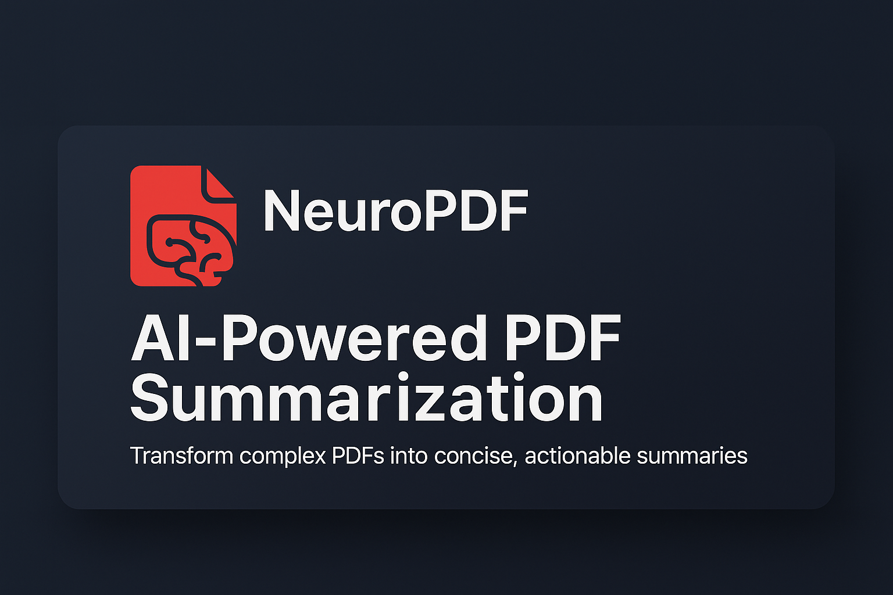

# 🧠 NeuroPDF

<div align="center">
  <p></p>
  
  <p></p>
  
  <p align="center">
    <a href="#features">Features</a> •
    <a href="#tech-stack">Tech Stack</a> •
    <a href="#demo">Demo</a> •
    <a href="#getting-started">Getting Started</a> •
    <a href="#environment-variables">Environment Variables</a> •
    <a href="#api-integrations">API Integrations</a> •
    <a href="#how-it-works">How It Works</a> •
    <a href="#license">License</a>
  </p>
</div>

---

## ✨ Features

- 📄 **PDF Upload & Processing** - Upload any PDF document and get it processed instantly
- 🤖 **AI-Powered Summaries** - Generate concise, well-structured summaries using OpenAI's GPT-4o or Google's Gemini AI
- 📱 **Responsive Design** - Beautiful, modern UI that works on desktop and mobile devices
- 🔒 **User Authentication** - Secure login/signup with Clerk authentication
- 💰 **Subscription Plans** - Free tier and paid subscription options via Stripe
- ⬇️ **Download Summaries** - Export and save your generated summaries
- 📊 **User Dashboard** - Track and manage all your processed PDFs
- 🌐 **Next.js App Router** - Modern, fast, and SEO-friendly web application

## 🛠️ Tech Stack

- **Frontend**: Next.js 15, React 19, TailwindCSS 4, Framer Motion, GSAP
- **Backend**: Next.js Server Components & Server Actions
- **Database**: Neon (PostgreSQL)
- **Authentication**: Clerk
- **AI Integration**: OpenAI API (GPT-4o), Google Gemini AI
- **File Handling**: UploadThing
- **Payment Processing**: Stripe
- **Styling**: TailwindCSS, shadcn/ui components

## 🎮 Demo

The application features several key sections:

- **Landing Page** with interactive animations and feature demonstrations
- **How It Works** section explaining the PDF summarization process
- **Pricing Plans** with free and premium tiers
- **Dashboard** for users to access their summaries
- **Upload Page** for submitting PDFs for processing
- **Summary Viewer** with beautiful formatting and download options

## 🚀 Getting Started

### Prerequisites

- Node.js 18.x or higher
- npm, yarn, or pnpm
- PostgreSQL database (or Neon serverless PostgreSQL)
- OpenAI API key
- Google Gemini AI API key (optional, for fallback)
- Clerk account for authentication
- Stripe account for payments
- UploadThing account for file uploads

### Installation

1. **Clone the repository**

```bash
git clone https://github.com/yourusername/neuro-pdf.git
cd neuro-pdf
```

2. **Install dependencies**

```bash
npm install
# or
yarn install
# or
pnpm install
```

3. **Set up environment variables**

Create a `.env.local` file in the root directory with the following variables:

```
# Database
DATABASE_URL=your_neon_postgres_connection_string

# Authentication (Clerk)
NEXT_PUBLIC_CLERK_PUBLISHABLE_KEY=your_clerk_publishable_key
CLERK_SECRET_KEY=your_clerk_secret_key
NEXT_PUBLIC_CLERK_SIGN_IN_URL=/sign-in
NEXT_PUBLIC_CLERK_SIGN_UP_URL=/sign-up
NEXT_PUBLIC_CLERK_AFTER_SIGN_IN_URL=/dashboard
NEXT_PUBLIC_CLERK_AFTER_SIGN_UP_URL=/dashboard

# AI APIs
OPENAI_API_KEY=your_openai_api_key
GEMINIAI_API_KEY=your_gemini_api_key

# File Upload (UploadThing)
UPLOADTHING_SECRET=your_uploadthing_secret
UPLOADTHING_APP_ID=your_uploadthing_app_id

# Payments (Stripe)
STRIPE_SECRET_KEY=your_stripe_secret_key
STRIPE_WEBHOOK_SECRET=your_stripe_webhook_secret
NEXT_PUBLIC_STRIPE_PUBLISHABLE_KEY=your_stripe_publishable_key
```

4. **Set up the database**

Create the required tables in your PostgreSQL database by running the SQL commands in `schema.sql`.

5. **Run the development server**

```bash
npm run dev
# or
yarn dev
# or
pnpm dev
```

6. **Open in browser**

Open [http://localhost:3000](http://localhost:3000) to see the application running.

## 🔑 Environment Variables

| Variable | Description |
|----------|-------------|
| `DATABASE_URL` | PostgreSQL connection string (Neon) |
| `OPENAI_API_KEY` | API key for OpenAI services |
| `GEMINIAI_API_KEY` | API key for Google Gemini AI (fallback) |
| `CLERK_*` | Clerk authentication configuration |
| `UPLOADTHING_*` | UploadThing file upload service credentials |
| `STRIPE_*` | Stripe payment processing credentials |

## 🔌 API Integrations

### OpenAI

The application uses OpenAI's GPT-4o model to generate high-quality summaries from PDF content. The system employs a specially crafted prompt template designed to create well-structured, engaging summaries with relevant emojis and proper markdown formatting.

### Google Gemini AI

As a fallback mechanism (e.g., when OpenAI rate limits are hit), the app uses Google's Gemini AI to ensure continuous operation. The same prompt template is used to maintain consistency in summary quality and formatting.

### Clerk Authentication

User authentication is handled by Clerk, providing secure sign-up, sign-in, and session management. The app integrates Clerk's components for a smooth authentication flow.

### Stripe Payments

The payment system uses Stripe to handle subscriptions and one-time payments. The app includes webhook handling for managing payment events and updating user subscription status.

### UploadThing

File uploads are managed by UploadThing, allowing for secure and efficient PDF file uploading with proper validation and storage.

## 🔄 How It Works

1. **Upload PDF**: Users upload their PDF document through the user-friendly upload interface.
2. **Text Extraction**: The application extracts text content from the PDF using LangChain's PDFLoader.
3. **AI Processing**: The extracted text is sent to either OpenAI's GPT-4o or Google's Gemini AI for processing.
4. **Summary Generation**: The AI generates a structured, engaging summary with relevant sections and emojis.
5. **Storage & Display**: The summary is stored in the database and displayed to the user in a beautiful markdown format.
6. **Management**: Users can access, view, and download their summaries from the dashboard.

## 📄 License

This project is licensed under the MIT License - see the LICENSE file for details.

---

<div align="center">
  <p>Made with ❤️ using Next.js, React, and AI</p>
</div>
